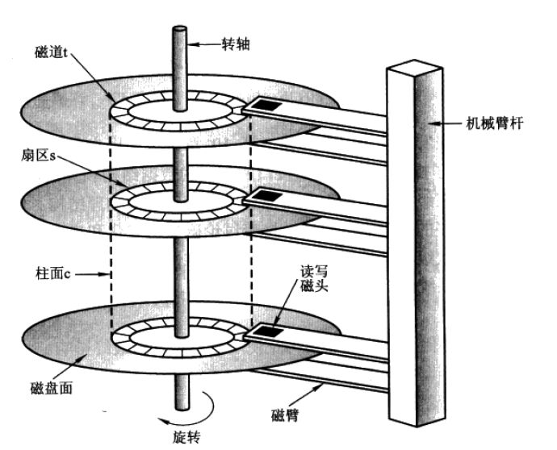

# 5、Linux磁盘管理

## 5.1、什么是磁盘

磁盘（disk）是指利用磁记录技术存储数据的存储器。

磁盘是计算机主要的存储介质，可以存储大量的二进制数据，并且断电后也能保持数据不丢失。早期计算机使用的磁盘是软磁盘（Floppy Disk，简称软盘），如今常用的磁盘是硬磁盘（Hard disk，简称硬盘）。


**磁盘运行原理：**

简单来说就是多个盘片之间靠主轴连接，电机带动主轴做旋转运动，通过多个磁头臂的摇摆和磁盘的旋转，磁头就可以在磁盘旋转的过程中就读取到磁盘中存储的各种数据



​															()

**磁盘的扇区、磁道、柱面：**
（1）磁道：磁盘的每个盘片被划分为许多同心圆，划分园的线条叫做磁道。

（2）扇区：硬盘的盘片被磁道划分成多个扇区。硬盘的读写以扇区为基本单位


（3）柱面：每一个盘片同一大小的同心圆可以看成连在一起的柱面，磁盘在分区的时候最小单位是柱面，每一个盘片的上下面都可以读取数据，每一个磁头，不可以跨盘面读取数据。


## 5.2、磁盘管理

Linux磁盘管理通常分成五个步骤，首先是添加硬盘，做RAID或逻辑卷LVM，然后进行分区，对分区进行格式化，最后挂载到文件系统中。

### 5.2.1、添加硬盘

当给计算机添加了一个新硬盘，我们可以怎么利用它呢？

首先简单介绍一下RAID和LVM的概念


**RAID**

磁盘阵列（Redundant Arrays of Independent Disks，RAID）。磁盘阵列是由很多块独立的磁盘，组合成一个容量巨大的磁盘组，利用个别磁盘提供数据所产生加成效果提升整个磁盘系统效能。利用这项技术，将数据切割成许多区段，分别存放在各个硬盘上。

以下是几种RAID模式：

* RAID0

  RAID0将数据分散在n个磁盘中，以独立的方式并行读取n个磁盘的数据，理论上，一个由n块磁盘组成的RAID0是单个磁盘性能的n倍。

* RAID1

  将数据分别写到两组磁盘中，分别为工作磁盘和镜像磁盘，相当于做了一次冗余，安全性高，但是成本也高。

* RAID10

  RAID10兼备了RAID1和RAID0的有优点。首先基于RAID1模式将磁盘分为2份，当要写入数据的时候，将所有的数据在两份磁盘上同时写入，相当于写了双份数据，起到了数据保障的作用。且在每一份磁盘上又会基于RAID0技术讲数据分为N份并发的读写，这样也保障了数据的效率。


**LVM**

LVM是 Logical Volume Manager（逻辑卷管理）的简写，它是Linux环境下对磁盘分区进行管理的一种机制。

Linux的用户经常会遇到一个问题，就是当磁盘分区空间不足了，调整分区大小非常麻烦。而LVM最大的作用就是解决这个问题。LVM将一个或多个硬盘的分区在逻辑上集合，相当于一个大硬盘来使用，当硬盘的空间不够使用的时候，可以继续将其它的硬盘的分区加入其中，这样可以实现磁盘空间的动态管理，相对于普通的磁盘分区有很大的灵活性。


### 5.2.2、分区

当硬盘添加成功后，便可以对硬盘进行分区了。


#### 5.2.2.1、为什么要分区

（1）方便管理，文件种类繁多的时候不易造成混乱。

（2）安全，当硬盘出现问题，又或者各类错误操作都可能造成数据损失。如果分区了，则可以减少损失。


#### 5.2.2.2、分区常用命令

fdisk是一个创建和维护分区表的程序，它兼容DOS类型的分区表、BSD或者SUN类型的磁盘列表。


```shell
fdisk [选项] <磁盘>  #更改分区表
fdisk [选项] -l [<磁盘>] #列出分区表		
```

 

| 选项 | 功能                                           |
| ---- | ---------------------------------------------- |
| -b   | 显示扇区计数和大小                             |
| -B   | 创建新标签时不要擦除 bootbits                  |
| -c   | 模式，为“dos”或“nondos”(默认)                  |
| -L   | 彩色输出(auto, always 或 never)                |
| -l   | 显示分区并退出                                 |
| -o   | 输出列                                         |
| -t   | 只识别指定的分区表类型                         |
| -u   | 显示单位，“cylinders”柱面或“sectors”扇区(默认) |
| -w   | 擦除签名(auto, always 或 never)                |
| -W   | 擦除新分区的签名(auto, always 或 never)        |
| -C   | 指定柱面数                                     |
| -H   | 指定磁头数                                     |
| -S   | 指定每条磁道的扇区数                           |
| -h   | 帮助文档                                       |


对某个磁盘分区，如 fdisk /dev/sda，则会出现以下菜单进行选择

- m ：显示菜单和帮助信息
- a ：活动分区标记/引导分区
- d ：删除分区
- l ：显示分区类型
- n ：新建分区
- p ：显示分区信息
- q ：退出不保存
- t ：设置分区号
- v ：进行分区检查
- w ：保存修改
- x ：扩展应用，高级功能


### 5.2.3、格式化

#### 5.2.3.1、什么是格式化

我们所说的格式化一般是指逻辑格式化，它是指根据用户选定的文件系统，在磁盘的特定区域写入特定数据，以达到初始化磁盘或磁盘分区、清除原磁盘或磁盘分区中所有文件的一个操作。

文件系统指操作系统用于明确存储设备或分区上的文件的方法和数据结构：即在存储设备上组织文件的方法。


#### 5.2.3.2、格式化常用命令

用法：

```shell
 mkfs [选项] [-t <类型>] [文件系统选项] <设备> [<大小>]
```

创建一个Linux 文件系统。

| 选项 | 功能                                |
| ---- | ----------------------------------- |
| -t   | 文件系统类型；若不指定，将使用 ext2 |
| -V   | 解释正在进行的操作；                |
| -h   | 帮助文档                            |
| -v   | 展示版本信息                        |


### 5.2.4、挂载

#### 5.2.4.1、什么是挂载

在Linux 系统中一切皆文件，所有文件都放置在以根目录为树根的树形目录结构中。在 Linux 看来，任何硬件设备也都是文件，它们各有自己的一套文件系统（文件目录结构）。挂载，指的就是将设备文件中的顶级目录连接到 Linux 根目录下的某一目录，访问此目录就等同于访问设备文件。


#### 5.2.4.2 mount命令

用法：

```shell
 mount [-lhV]
 mount -a [选项]
 mount [选项] [--source] <源> | [--target] <目录>
 mount [选项] <源> <目录>
 mount <操作> <挂载点> [<目标>]
```

因选项过多，这里不做详解，可以在命令行输入 mouunt -h 获取帮助文档。

**示例1**

```shell
mount /dev/usb /mnt/usb
```

用默认方法将/dev/usb 挂载到 /mnt/usb

#### 5.2.4.2 umount命令u

用法：

```
umount [-fn] 装置文件名或挂载点
```

选项与参数：

- -f ：强制卸除！可用在类似网络文件系统 (NFS) 无法读取到的情况下；
- -n ：不升级 /etc/mtab 情况下卸除。

### 5.2.5 查看

#### 5.2.5.1 df

最常用的一个命令

参数功能：检查文件系统的磁盘空间占用情况。可以利用该命令来获取硬盘被占用了多少空间，目前还剩下多少空间等信息。

语法：

```
df [-ahikHTm] [目录或文件名]
```

选项与参数：

- -a ：列出所有的文件系统，包括系统特有的 /proc 等文件系统；
- -k ：以 KBytes 的容量显示各文件系统；
- -m ：以 MBytes 的容量显示各文件系统；
- -h ：以人们较易阅读的 GBytes, MBytes, KBytes 等格式自行显示；
- -H ：以 M=1000K 取代 M=1024K 的进位方式；
- -T ：显示文件系统类型, 连同该 partition 的 filesystem 名称 (例如 ext3) 也列出；
- -i ：不用硬盘容量，而以 inode 的数量来显示

#### 5.2.5.2 du

Linux du命令也是查看使用空间的，但是与df命令不同的是Linux du命令是对文件和目录磁盘使用的空间的查看，还是和df命令有一些区别的。

语法：

```
du [-ahskm] 文件或目录名称
```

选项与参数：

- -a ：列出所有的文件与目录容量，因为默认仅统计目录底下的文件量而已。
- -h ：以人们较易读的容量格式 (G/M) 显示；
- -s ：列出总量而已，而不列出每个各别的目录占用容量；
- -S ：不包括子目录下的总计，与 -s 有点差别。
- -k ：以 KBytes 列出容量显示；
- -m ：以 MBytes 列出容量显示；

#### 5.2.5.3 du df区别

1. du和df命令都被用于获得文件系统大小的信息：df用于报告文件系统的总块数及剩余块数，du -s /<filesystem>用于报告文件系统使用的块数。
2. du -s命令通过将指定文件系统中所有的目录、符号链接和文件使用的块数累加得到该文件系统使用的总块数；而df命令通过查看文件系统磁盘块分配图得出总块数与剩余块数。 

例如：如果用户删除了一个正在运行的应用所打开的某个目录下的文件，则du命令返回的值显示出减去了该文件后的目录的大小。但df命令并不显示减去该文件后的大小。**直到该运行的应用关闭了这个打开的文件，df返回的值才显示出减去了该文件后的文件系统的使用情况。**

> du df 的区别    https://developer.aliyun.com/article/297079

### 5.2.6 检查

#### 5.2.6.1 fsck

fsck（file system check）用来检查和维护不一致的文件系统。

若系统掉电或磁盘发生问题，可利用fsck命令对文件系统进行检查。

语法：

```
fsck [-t 文件系统] [-ACay] 装置名称
```

选项与参数：

- -t : 给定档案系统的型式，若在 /etc/fstab 中已有定义或 kernel 本身已支援的则不需加上此参数
- -s : 依序一个一个地执行 fsck 的指令来检查
- -A : 对/etc/fstab 中所有列出来的 分区（partition）做检查
- -C : 显示完整的检查进度
- -d : 打印出 e2fsck 的 debug 结果
- -p : 同时有 -A 条件时，同时有多个 fsck 的检查一起执行
- -R : 同时有 -A 条件时，省略 / 不检查
- -V : 详细显示模式
- -a : 如果检查有错则自动修复
- -r : 如果检查有错则由使用者回答是否修复
- -y : 选项指定检测每个文件是自动输入yes，在不确定那些是不正常的时候，可以执行 # fsck -y 全部检查修复。

## 参考资料

[1] 《大学计算机基础》编写组编写．大学计算机基础：中国铁道出版社，2015.09

[2] 百度百科 https://baike.baidu.com/item/%E7%A3%81%E7%9B%98/2842227?fr=aladdin

[3] 菜鸟教程 https://www.runoob.com/linux/linux-filesystem.html